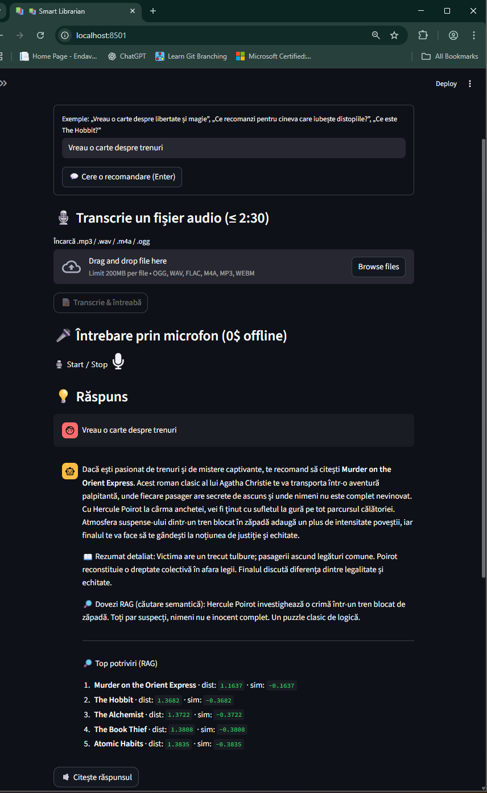
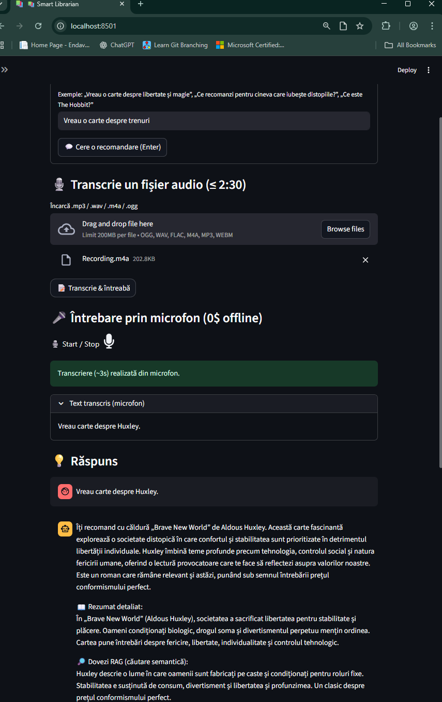

# 📚 Smart Librarian — RAG + Tool Calling (ChromaDB + OpenAI)

Un chatbot care recomandă cărți în funcție de interesele utilizatorului folosind **RAG** (retrieval-augmented generation) cu **ChromaDB** + embeddings OpenAI, apoi completează recomandarea cu rezumatul complet printr-un tool separat (`get_summary_by_title`). UI în **Streamlit**, opțional **TTS**, **STT** și **imagini AI**.

---

## 🗂️ Structură proiect
```text
.
├── api/
│   ├── main.py                 # (opțional) endpoint-uri HTTP / health / seed etc.
│   └── static/                 # fișiere statice pentru API (logo, assets)
│
├── chroma_store/               # PERSIST: baza Chroma (montată în Docker)
│   ├── chroma.sqlite3
│   ├── books.sha1
│   └── ....../           # dir intern creat de Chroma
│
├── data/
│   ├── book_summaries.yaml     # baza de cunoștințe (titlu, summary, full_summary, themes)
│   └── tmp_audio/              # fișiere audio temporare (TTS/STT)
│
├── img/
│   ├── __init__.py
│   └── ai_gen.py               # generare imagini (gpt-image-1) – copertă / scenă
│
├── rag/
│   ├── __init__.py
│   ├── embed_store.py          # încărcare YAML, fingerprint, inițializare ChromaDB
│   └── retriever.py            # căutare semantică + Top-K + snippete + scor încredere
│
├── safety/
│   ├── __init__.py
│   └── moderation.py           # Moderation API + fallback local
│
├── scripts/
│   ├── doctor_config.py        # utilitar de verificare config (.env, modele)
│   └── seed_books.py           # script de populare / rebuild vector store (opțional)
│
├── stt/
│   ├── __init__.py
│   └── transcribe.py           # STT offline (faster-whisper) + online (OpenAI)
│
├── tools/
│   ├── __init__.py
│   └── summary_tool.py         # tool: get_summary_by_title(title) → rezumat complet
│
├── ui/
│   ├── __init__.py
│   └── app_streamlit.py        # UI principală: RAG debug, TTS, STT, imagini
│
├── .dockerignore               # exclude .env, chroma_store, __pycache__, tmp etc. din build
├── .env                        # chei & config (IGNORAT în git)
├── .gitignore                  # ignoră .env, chroma_store, tmp_audio, __pycache__, *.pyc
├── Dockerfile
├── docker-compose.yml
├── README.md
├── requirements.txt
├── chatbot.py                  # orchestrare: Moderation → RAG → LLM + Tool → răspuns
├── config.py                   # citește .env și expune setările (MODELE, PERSIST_DIR etc.)
└── main.py                     # (opțional) runner local sau alias – nu e folosit în Docker
```
## ▶️ Rulare

### A) Cu Docker (recomandat)
```bash
docker compose up --build
# UI: http://localhost:8501
```

### B) Local (fără Docker)
```bash
python -m venv .venv
# PowerShell: .venv\Scripts\Activate.ps1
# bash/zsh: source .venv/bin/activate

pip install -r requirements.txt
streamlit run ui/app_streamlit.py
# UI: http://localhost:8501
```

---

## 🧑‍💻 Ghid de folosire
1. Deschide UI: <http://localhost:8501>  
2. Scrie în câmp, de exemplu:
   - „Vreau o carte despre libertate și control social.”
   - „Ce recomanzi pentru cineva care iubește povești fantastice?”
   - „Ce este 1984?”
3. Apasă **„💬 Cere o recomandare (Enter)”**.  
4. Vezi răspunsul conversațional + rezumat detaliat (via tool).  
5. Bifează **„Arată Top-K (debug RAG)”** pentru:
   - Top-K din vector store (distanțe),
   - Snippete relevante (dovezi RAG),
   - Scor de încredere (d1 & diferența față de locul #2).
6. *(Opțional)* **TTS**: citește răspunsul audio.  
7. *(Opțional)* **STT**: încarcă un fișier sau folosește microfonul (alege limba – ex. „ro” – și motorul; apasă „Transcrie & întreabă”).  
8. *(Opțional)* **Imagini AI**: generează o copertă sau o scenă pentru cartea recomandată.

<p align="center">
  
</p>
<p align="center">
  
</p>
<p align="center">
  
</p>
<p align="center">
  
</p>
<p align="center">
  
</p>
<p align="center">
  
</p>

---

## ✅ Milestones
- **Bază de date de rezumate (≥10 cărți)** – fișier: `data/book_summaries.yaml` (conține `title`, `summary`, `full_summary`, `themes`).  
- **Vector store non-OpenAI** – stocare în **ChromaDB** (persistență pe disc în `chroma_store/`).  
- **Embeddings OpenAI** – model `text-embedding-3-small` (configurabil) folosit pentru indexare și căutare semantică.  
- **Retriever semantic (teme/context)** – `rag/retriever.py` face similaritate pe conținut (summary + full_summary + themes), nu pe titlu; UI expune Top-K + snippete + scor de încredere (distanță & gap).  
- **Chatbot integrat cu GPT + Tool Calling** – `chatbot.py` orchestrează: Moderation → RAG → Chat (model mic din `.env`) → apel tool `get_summary_by_title` → răspuns final.  
- **Tool** `get_summary_by_title(title: str)` – `tools/summary_tool.py` returnează rezumatul complet pentru titlul exact (case-insensitive).  
- **UI (Streamlit)** – `ui/app_streamlit.py` cu: input text, debug RAG, TTS, STT (offline/online), generare imagine AI.  
- *(Opțional)* **TTS / STT / Imagini**:  
  - **TTS**: OpenAI `tts-1` sau offline `pyttsx3`.  
  - **STT**: offline `faster-whisper` (tiny/base/small) + online `gpt-4o-mini-transcribe`/`whisper-1`.  
  - **Imagini**: `gpt-image-1` (prompturi low-cost, cache la nivel de sesiune).  
- **Moderation (opțional)** – `safety/moderation.py` + fallback local pe blocklist dacă API-ul de moderare nu răspunde.

---

## ⚙️ Cum funcționează
1. **Încărcare & normalizare date** – `rag/embed_store.py` citește `data/book_summaries.yaml`, normalizează și calculează un fingerprint (sha1).  
2. **Indexare** – dacă fingerprint-ul diferă, (re)creează colecția `books` în ChromaDB cu embeddings OpenAI (doar conținutul: `summary + full_summary + themes`).  
3. **Interogare** – `rag/retriever.py` face semantic search (cosine distance). UI arată Top-K, snippete și confidence (d1 & gap față de locul 2).  
4. **LLM + Tool** – `chatbot.py` primește candidatul RAG și lista scurtă, decide recomandarea, apelează tool-ul `get_summary_by_title`, îmbină într-un răspuns conversațional și afișează dovezi RAG.

---

## 🔧 Configurare

### 1) `.env` (NU este în repo; e ignorat de `.gitignore` & `.dockerignore`)
```dotenv
OPENAI_API_KEY=...
CHAT_MODEL=gpt-4o-mini
EMBED_MODEL=text-embedding-3-small
PERSIST_DIR=/app/chroma_store

# Moderation
MODERATION_ENABLED=1
MODERATION_MODEL=omni-moderation-latest

# TTS
TTS_MODE=openai           # openai | offline | off
TTS_VOICE=alloy
TTS_FORMAT=mp3
TTS_RATE=170
TTS_VOLUME=0.8

# STT offline model (poți alege și din UI)
FWHISPER_MODEL=base

# Audio/cache
AUDIO_DIR=/tmp/audio
```

### 2) Dependențe
- **Docker**: include `ffmpeg`, `espeak-ng`, `libgomp1`.  
- **Local (fără Docker)**:  
  - Python **3.11+**  
  - `ffmpeg` instalat în PATH (necesar pentru pydub/STT)  
  - `pip install -r requirements.txt`

---

